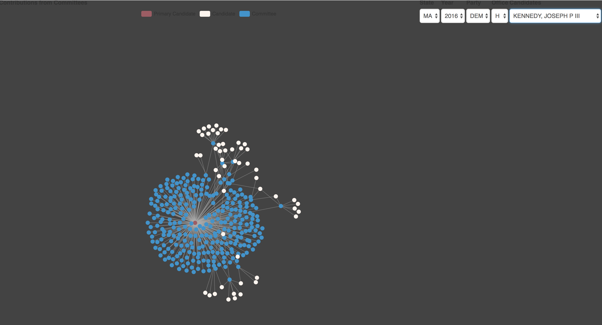

# Governetworks
Governet is a tool to load, process and visualize campaign finance data from the [Federal Election Commission](https://www.fec.gov/).  When you run governet, you get a fully operational application pre-loaded with FEC campagin finance data from the last 8 year, and an API to query that data.  

Governet provides structured visualizations built on an uderlying API and toolset which expose the data. Look for API documentation in the next release.

Governet is a work in progress in the very earliest stages.  The currently narrow scope of the API and visualizations will be exapnding in each subsequent release.  The API will be purposefully structured in such a way to provide generic data which can be consumed by a variety of custom and, eventually, off-the-shelf applications.  API documentation is on the roadmap for the next release.

Currently, Governet comes pre-loaded with Committee, Candidate and Individual contribution data from 2010 - 2018, and a network graph visualizaing the committees who have contributed to a given candidate.  

When you select a candidate, Governet will display all of the committees who have contributed to that candidate.  It will also show you the candidates that the displayed committees have contributed a major gift toward ($5000 or more).  

## The Data
All of the data used in Governet is obtained from the Federal Election Comission.  Specifically, the data is downloaded in bulk format from the official [Federal Election Committee FTP server](https://cg-519a459a-0ea3-42c2-b7bc-fa1143481f74.s3-us-gov-west-1.amazonaws.com/bulk-downloads/index.html).  Currently Governet is using candidate (cn), committe (cm), and individual contribution (itpas) detailed data files.  

## The Application
Governet is an N-tier web application.  A front end provides a user interface to an API which querys an underlying database.  The front end is built in React.js.  The back end server is written in Node.js, using the Express framework for the API.  The database is MongoDB.  The application is composed with Docker and Docker Compose.  Some data loading is done in bash scripts.

## Running Governet Locally with Docker Compose
Before you get started, you'll need [Docker Community Edition](https://docs.docker.com/install/) if you don't already have it.

To run Governet, you'll need to download the source, build the containers with docker compose, and then restore the database.

- Clone the repository
- Build and start the application with docker: `docker-compose up --build`.  This will build and start the frontend, backend and database containers. 
- Restore the database and build the indexes:  
    `docker exec -it v2_mongodb_1 bash -c 'mongorestore /opt/dump/governet && mongo governet --eval "db.cm.createIndex({CMTE_ID: 1, CAND_ID: 1})" && mongo governet --eval "db.cn.createIndex({CAND_ID: 1})" && mongo governet --eval "db.pas2.createIndex({CAND_ID: 1, CMTE_ID: 1})"'`
- Connect to the app on port 5000

## Navigating the App

The app consists of 3 containers, one which serves the React frontend, one which runs the node/express API and data parser, and the mongo database.  The database container is instantiated with a data dump on it, but it must be restored with the above command for the applicaiton to function.  See `docker-compose.yml` and each individual `Dockerfile` for more information.

Once the above steps are completed, you can view the frontend of the application on localhost port 5000.  Check out the 2016 MA Democract House candidates for some good examples (MA 2016 DEM H), such as Joseph Kennedy.

## The API
Once the application is up, you can query the API on locahost 8080. Try `http://127.0.0.1:8080/candidate?party=DEM&state=MA&year=2016&candOffice=H` for an example.  This query will show you each candidate whose party is DEM in the state MA and year 2016 who run for the House.  If you want to see candidates in a different state, party, year or office, simply change the queries in the URL -- for example, modify the candOffice=H to candOffice=S to see all of the Senate candidates.  

Note that all of the available data is not loaded in this deployment -- it would be expensive to host all of that data on s3 to provide the local data dumps on each build.  Functionality to download and load additional data will be added in future releases.

Dan
d.c.budris@gmail.com
dbudris@bu.edu
