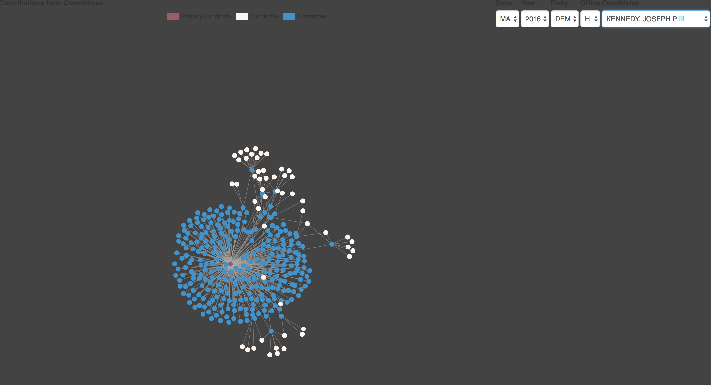

# Governetworks
Governetworks is a tool to load, process and visualize federal campaign finance data.  It provides structured visualizations out-of-the-box, which are built on an uderlying API and toolset.  API documentation is an issue to be addressed in an upcomming release.

## The Data
All of the data used in Governet is obtained from the Federal Election Comission.  Specifically, the data is downloaded in bulk format from the official [Federal Election Committee FTP server](https://cg-519a459a-0ea3-42c2-b7bc-fa1143481f74.s3-us-gov-west-1.amazonaws.com/bulk-downloads/index.html).  Currently Governet is using candidate (cn), committe (cm), and individual contribution (itpas) detailed data files.  

## The Application
A front end web application provides a user interface to an API which querys an underlying database.  The front end is built in React.js.  The back end server is written in Node.js, using the Express framework for the API.  The database is MongoDB.    The application is composed with Docker and Docker Compose.  Some data loading is done in bash scripts.

## Running Governet Locally with Docker Compose
Before you get started, you'll need [Docker Community Edition.](https://docs.docker.com/install/) if you don't already have it.

To run Governet, you'll need to download the source, build the containers with docker compose, and then restore the database.

- Clone the repository
- Build and start the application with docker: `docker-compose up --build`.  This will build and start the frontend, backend and database containers. 
- Restore the database and build the indexes:  
    `docker exec -it v2_mongodb_1 bash -c 'mongorestore /opt/dump/governet && mongo governet --eval "db.cm.createIndex({CMTE_ID: 1, CAND_ID: 1})" && mongo governet --eval "db.cn.createIndex({CAND_ID: 1})" && mongo governet --eval "db.pas2.createIndex({CAND_ID: 1, CMTE_ID: 1})"'`
- Connect to the app on port 5000

## Navigating the App

The app consists of 3 containers, one which serves the React frontend, one which runs the node/express API and data parser, and the mongo database.  The database container is instantiated with a data dump on it, but it must be restored with the above command for the applicaiton to function.  See `docker-compose.yml` and each individual `Dockerfile` for more information.

Once the above steps are completed, you can view the frontend of the application on localhost port 5000.  Check out the 2016 MA Democract House candidates for some good examples (MA 2016 DEM H), such as Joseph Kennedy.

You can query the API on locahost 8080, try `http://127.0.0.1:8080/candidate?party=DEM&state=MA&year=2016&candOffice=H` for an example.

Note that all of the available data is not loaded in this deployment -- it would be expensive to host all of that data on s3 to provide the local data dumps on each build.  Once this is actually deployed it'll be a different story.  

Dan
d.c.budris@gmail.com
dbudris@bu.edu
